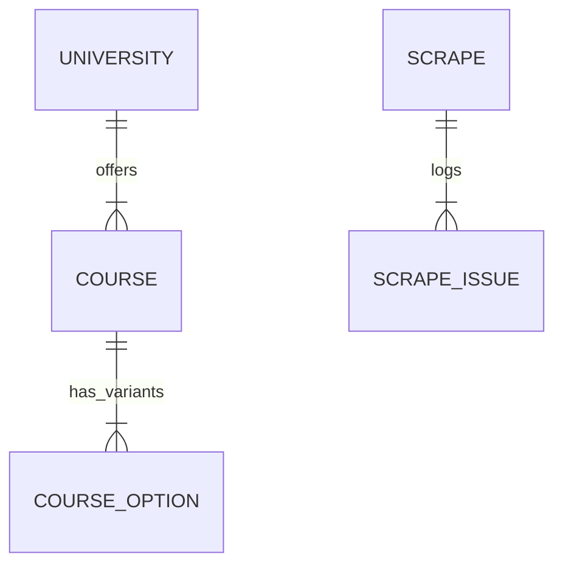

# Database Documentation (Layer 2)

This document details the database schema, entity relationships, and management using Prisma ORM.

## 🗄 Overview

- **Database**: PostgreSQL
- **ORM**: Prisma (Models, Migrations, Client)
- **Schema**: `backend/prisma/schema.prisma`

## 📊 Data Models

The key database models are:

### 1. `University`
Represents a higher education institution that the system scrapes.
- **`id`**: Unique identifier (UUID).
- **`ukprn`**: Unique identifier (UKPRN) from UK government data.
- **`courses`**: Relationship to `Course`.

### 2. `Course`
Details of a specific course, linked 1-to-many with a University.
- **`ucasCourseId`**: Unique identifier used by UCAS.
- **`title`**: Course name (e.g., "Computer Science BSc").
- **`courseUrl`**: The raw URL used for scraping fee info.
- **`options`**: Relationship to `CourseOption` (variants like full-time/part-time).

### 3. `CourseOption`
Specific variants of a course, storing the actual fee data.
- **`year`**: Academic year (e.g., 2026).
- **`homeFee`**: Tuition fee for domestic students.
- **`internationalFee`**: Tuition fee for international students.
- **`studyMode`**: Full-time, Part-time, Sandwich, etc.
- **`aLevelGrade1-4`**: Specific grade requirements (e.g., A*AA).

### 4. `Scrape` & `ScrapeIssue`
Tracks the history and status of scraping operations.
- **`status`**: Enum (`PENDING`, `RUNNING`, `FAILED`, `COMPLETED`).
- **`issues`**: Logs any errors or warnings encountered during scrape runs.

### 5. `Session`
Stores user session data for authentication using `express-session` and `@quixo3/prisma-session-store`.

---

## 🔄 Relationships

- **University** (1) ↔ (N) **Course**
- **Course** (1) ↔ (N) **CourseOption**
- **Scrape** (1) ↔ (N) **ScrapeIssue**

Here is a simplified visual representation of the relationships:



## 🛠 Database Management

### Migrations
All schema changes are versioned in `prisma/migrations`. 
**To create a new migration:**
```bash
npx prisma migrate dev --name <descriptive_name>
```

**To apply pending migrations:**
```bash
npx prisma migrate deploy
```

### Seeding
Initial data (universities, scraper configurations) can be populated using seed scripts if configured in `package.json`.

### Prisma Studio
To inspect data visually:
```bash
npx prisma studio
```

## 📝 Maintenance Notes

- **Performance**: Large scrape histories (`ScrapeIssue` table) should be periodically cleaned up if the database grows too large.
- **Unique Constraints**: Ensure `ucasCourseId` remains unique to prevent duplicate course entries during updates.
- **Backups**: Regular `pg_dump` backups are recommended before major schema migrations.
